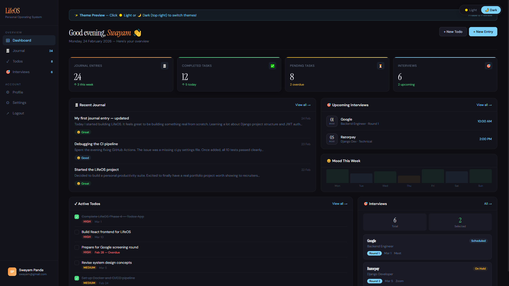

# LifeOS 🧠

> Your personal operating system — Journal, Tasks & Interview Tracker

A full-stack productivity suite built with Django REST Framework + React. Clean, minimal UI with dark/light theme support.


## 🖥 UI Preview



👉 [View Interactive Preview](https://iamswayam.github.io/lifeos/) — Switch between Dark & Light themes!


---

## Features

- 📓 **Daily Journal** — Write entries with mood tracking, tags, word count & mood filter
- ✅ **Todo Manager** — Priority levels, due dates, categories, status toggle (pending / in progress / done)
- 🎯 **Interview Tracker** — Track rounds, feedback, results, scheduled dates, prep notes
- 🔐 **JWT Authentication** — Register, login, logout with token refresh
- 🌐 **Google OAuth** — One-click sign in with Google
- 🌗 **Dark / Light Theme** — Smooth theme switcher, preference saved locally
- 👤 **Profile & Settings** — Edit name, username, bio, avatar upload, change password
- 📊 **Dashboard** — Stats overview, recent journal entries, upcoming interviews, active todos

---

## Tech Stack

| Layer | Technology |
|-------|-----------|
| Backend | Django 4.2, Django REST Framework |
| Auth | JWT (SimpleJWT), Google OAuth (django-allauth) |
| Database | PostgreSQL (prod), SQLite (dev) |
| Cache | Redis (prod), DummyCache (dev/test) |
| Frontend | React 18, Vite, React Router, Axios |
| Styling | CSS Variables (custom design system, no UI library) |
| DevOps | GitHub Actions CI/CD |

---

## Project Structure

```
lifeos/
├── apps/
│   ├── accounts/        # Auth, JWT, Google OAuth, Profile
│   ├── journal/         # Journal entries, mood tracking
│   ├── todos/           # Todo management
│   └── interviews/      # Interview tracking
├── frontend/
│   ├── src/
│   │   ├── api/         # Axios API calls
│   │   ├── components/  # Reusable components (Sidebar, Layout)
│   │   ├── context/     # Auth & Theme context
│   │   └── pages/       # Auth, Dashboard, Journal, Todos, Interviews, Profile
├── lifeos/
│   └── settings/        # base / dev / prod / ci
├── requirements/        # base / dev / prod
└── .github/workflows/   # CI/CD pipeline
```

---

## Getting Started

### Prerequisites
- Python 3.12+
- Node.js 18+
- PostgreSQL (optional, SQLite works for dev)
- Redis (optional, DummyCache used in dev)

### Backend Setup

```bash
# Clone the repo
git clone https://github.com/iamswayam/lifeos.git
cd lifeos

# Create virtual environment
python -m venv venv
venv\Scripts\activate        # Windows
source venv/bin/activate     # Mac/Linux

# Install dependencies
pip install -r requirements/dev.txt

# Create .env file in project root
GOOGLE_CLIENT_ID=your_google_client_id
GOOGLE_CLIENT_SECRET=your_google_client_secret

# Run migrations
python manage.py migrate

# Start Django server
python manage.py runserver
```

### Frontend Setup

```bash
cd frontend
npm install
npm run dev
```

Visit `http://localhost:5173`

---

## API Endpoints

### Auth
| Method | Endpoint | Description |
|--------|----------|-------------|
| POST | `/api/auth/register/` | Register new account |
| POST | `/api/auth/login/` | Login with email + password |
| POST | `/api/auth/logout/` | Logout (blacklist token) |
| GET/PATCH | `/api/auth/me/` | Get / update profile |
| POST | `/api/auth/change-password/` | Change password |
| POST | `/api/auth/google/` | Google OAuth login |
| POST | `/api/auth/token/refresh/` | Refresh JWT token |

### Journal
| Method | Endpoint | Description |
|--------|----------|-------------|
| GET/POST | `/api/journal/entries/` | List / create entries |
| GET/PUT/DELETE | `/api/journal/entries/{id}/` | Retrieve / update / delete |

### Todos
| Method | Endpoint | Description |
|--------|----------|-------------|
| GET/POST | `/api/todos/` | List / create todos |
| GET/PUT/DELETE | `/api/todos/{id}/` | Retrieve / update / delete |
| PATCH | `/api/todos/{id}/toggle_status/` | Toggle status |

### Interviews
| Method | Endpoint | Description |
|--------|----------|-------------|
| GET/POST | `/api/interviews/` | List / create interviews |
| GET/PUT/DELETE | `/api/interviews/{id}/` | Retrieve / update / delete |
| PATCH | `/api/interviews/{id}/add-feedback/` | Add feedback & result |
| GET | `/api/interviews/upcoming/` | Upcoming interviews |
| GET | `/api/interviews/summary/` | Stats summary |

---

## Running Tests

```bash
python manage.py test apps.accounts.tests apps.journal.tests --verbosity=2
```

10 tests — all passing ✅

---

## CI/CD

GitHub Actions runs on every push to `main`:
- Sets up PostgreSQL + Redis
- Installs dependencies
- Runs all tests
- Reports pass/fail

---

## Roadmap

- [x] Phase 1 — Project setup & configuration
- [x] Phase 2 — Accounts app + JWT auth
- [x] Phase 3 — Journal app
- [x] Phase 4 — Todos app
- [x] Phase 5 — Interviews app
- [x] Phase 6 — API documentation (Swagger)
- [x] Phase 7 — CI/CD GitHub Actions
- [x] Phase 8 — React frontend (Dashboard, Journal, Todos, Interviews)
- [x] Phase 9 — Google OAuth + Profile & Settings
- [ ] Phase 10 — LinkedIn OAuth
- [ ] Phase 11 — Deployment (Railway + Vercel)

---

## Author

**Swayam Siddha Panda** — [github.com/iamswayam](https://github.com/iamswayam)

---

## License

MIT License — free to use, modify and distribute